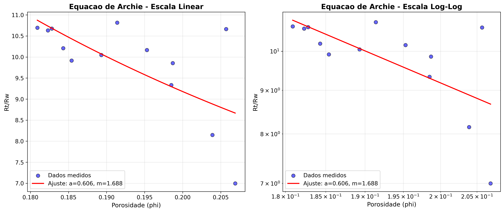
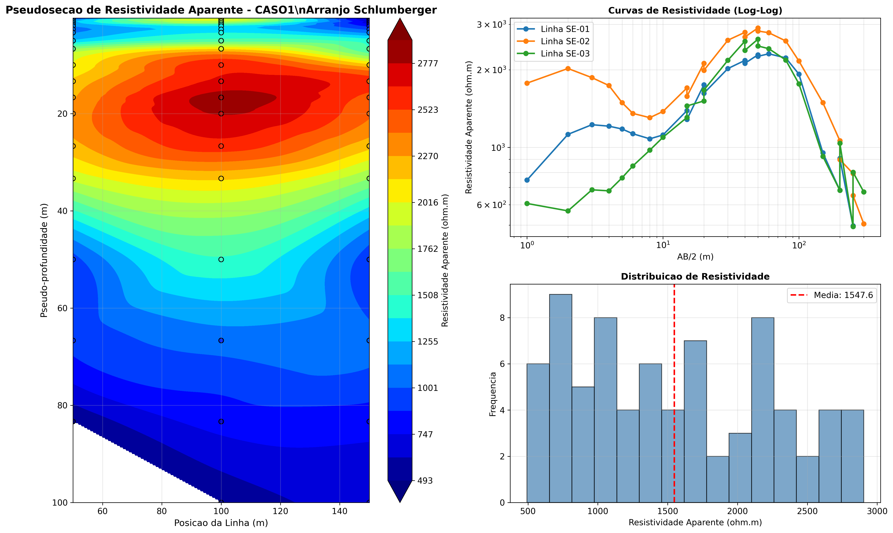
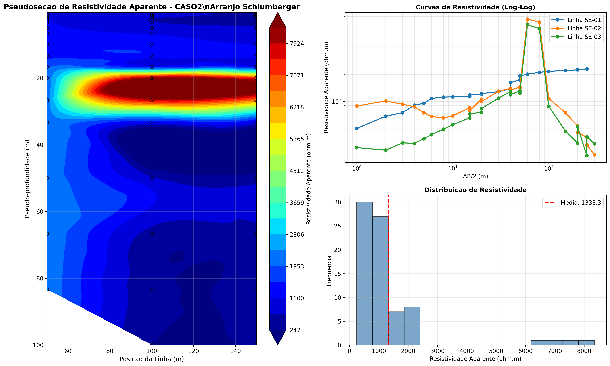
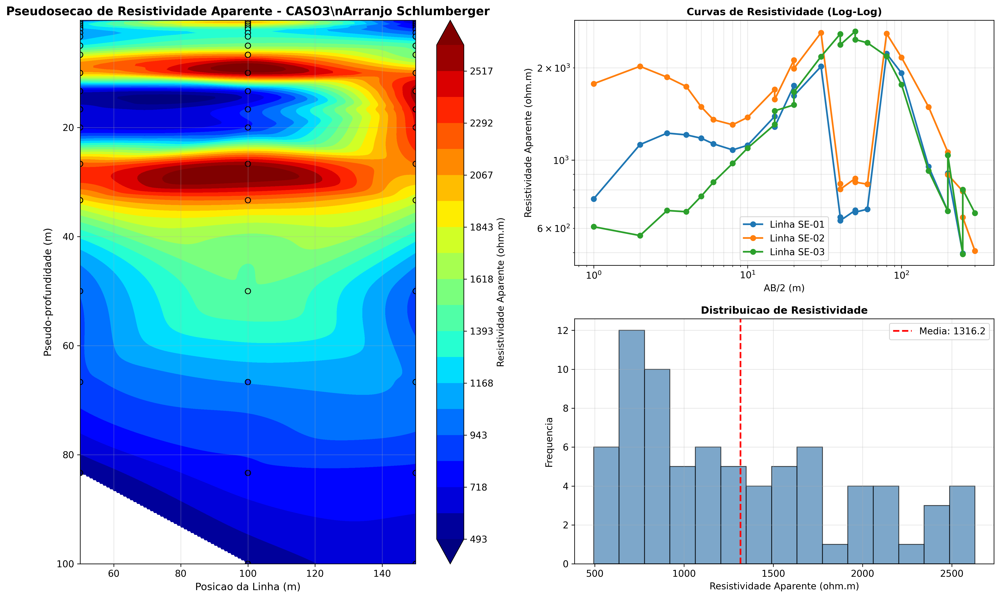
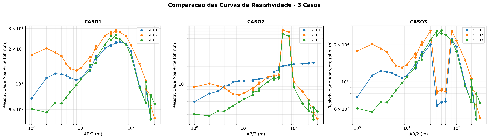

# ANALISE DOS GRAFICOS
## Trabalho Computacional - Metodos Eletricos em Geofisica

Data: 13 de Outubro de 2025

---

## INTRODUCAO

Este documento apresenta uma analise detalhada dos graficos gerados nos exercicios computacionais, focando nos aspectos visuais, padroes observados e suas implicacoes geologicas.

---

## EXERCICIO 1 - LEI DE ARCHIE

### Grafico: Rt/Rw vs Porosidade

Arquivo: `Exercicio1_Archie/exercicio1_archie_grafico.png`

O grafico apresenta duas visualizacoes complementares dos dados:

#### Painel Esquerdo: Escala Linear

**Caracteristicas Observadas:**

1. **Dispersao dos Pontos**
   - Os pontos apresentam dispersao moderada em torno da curva de ajuste
   - Maior concentracao de dados na faixa de porosidade entre 0,18 e 0,21
   - Alguns pontos afastados da curva, indicando variabilidade natural

2. **Tendencia Geral**
   - Relacao inversamente proporcional clara entre Rt/Rw e porosidade
   - A curva de ajuste (linha vermelha) segue a tendencia geral dos dados
   - Valores de Rt/Rw variam aproximadamente de 7 a 11

3. **Qualidade do Ajuste**
   - Ajuste razoavel considerando a natureza heterogenea das rochas carbonaticas
   - Alguns pontos apresentam desvios mais significativos, especialmente nas extremidades
   - Isto e esperado devido a variacoes na cimentacao e estrutura porosa

**Interpretacao:**

A dispersao observada e consistente com rochas carbonaticas, que tipicamente apresentam heterogeneidade na distribuicao e geometria dos poros. Rochas com mesma porosidade podem ter diferentes resistividades devido a:
- Variacoes no grau de cimentacao
- Diferente conectividade dos poros
- Presenca de minerais condutores
- Tortuosidade variavel

#### Painel Direito: Escala Log-Log

**Caracteristicas Observadas:**

1. **Linearizacao dos Dados**
   - Em escala logaritmica, a relacao de Archie se torna linear
   - Os pontos alinham-se razoavelmente ao longo de uma reta
   - Facilita a visualizacao da relacao potencial

2. **Inclinacao da Reta**
   - A inclinacao negativa corresponde ao expoente -m na equacao de Archie
   - Inclinacao aparente consistente com m ≈ 1,69
   - Indica relacao potencial bem definida apesar da dispersao

3. **Distribuicao dos Residuos**
   - Residuos distribuidos de forma relativamente uniforme ao longo da reta
   - Nao ha padrao sistematico de desvios (o que seria problematico)
   - Alguns outliers nas extremidades do intervalo de porosidade

**Interpretacao Tecnica:**

A visualizacao log-log confirma que o modelo de Archie e apropriado para estes dados, apesar do R² moderado. A ausencia de tendencias sistematicas nos residuos indica que o modelo captura a fisica basica do fenomeno, e que a dispersao e devida a heterogeneidade real da rocha, nao a inadequacao do modelo.

### Implicacoes Geologicas a partir dos Graficos

1. **Heterogeneidade da Rocha**
   - A dispersao visual confirma sistema poroso complexo
   - Variacoes sugerem mistura de diferentes tipos de poros

2. **Adequacao do Modelo**
   - Apesar da dispersao, a tendencia e clara
   - Modelo de Archie captura comportamento medio adequadamente

3. **Qualidade dos Dados**
   - Distribuicao dos pontos indica medidas consistentes
   - Ausencia de outliers extremos sugere boa qualidade experimental

---

## EXERCICIO 2 - SONDAGEM ELETRICA VERTICAL (SEV)

### CASO 1: Ambiente Homogeneo

Arquivo: `Exercicio2_SEV/exercicio2_SEV_caso1_analise.png`

#### Pseudosecao (Grafico Principal)

**Caracteristicas Visuais:**

1. **Padrao de Cores**
   - Dominancia de cores quentes (amarelo/laranja) na escala de cores
   - Transicao gradual de cores com a profundidade
   - Pouca variacao lateral entre as tres linhas de sondagem

2. **Estrutura Vertical**
   - Aumento progressivo da resistividade com profundidade
   - Ausencia de interfaces abruptas
   - Gradacao suave indicando transicao gradual entre camadas

3. **Distribuicao Espacial**
   - Homogeneidade lateral bem marcada
   - As tres linhas (SE-01, SE-02, SE-03) apresentam comportamento similar
   - Indica continuidade lateral das unidades geologicas

**Interpretacao Geologica:**

A pseudosecao sugere um ambiente geologico relativamente simples com duas unidades principais:
- **Camada Superior (0-20m)**: Resistividade moderada (~500-1000 Ω·m), possivelmente solo ou rocha alterada
- **Camada Profunda (20-100m)**: Resistividade alta (>1500 Ω·m), rocha cristalina consolidada

#### Curvas de Resistividade (Log-Log)

**Caracteristicas:**

1. **Formato das Curvas**
   - Curvas tipo "A" (ascendentes)
   - Aumento monotônico com AB/2
   - Similaridade entre as tres linhas

2. **Comportamento em Profundidade**
   - Inicio em ~500 Ω·m para espacamentos pequenos
   - Aumento progressivo ate ~2900 Ω·m
   - Tendencia de estabilizacao em grandes espacamentos

**Interpretacao:**

O formato ascendente indica modelo de duas camadas com camada superior mais condutiva sobre camada inferior mais resistiva. Isto e consistente com:
- Solo/rocha alterada superficial
- Embasamento cristalino em profundidade

#### Histograma de Resistividade

**Observacoes:**

- Distribuicao unimodal deslocada para valores altos
- Concentracao principal entre 1200-1800 Ω·m
- Ausencia de picos secundarios (confirma homogeneidade)

---

### CASO 2: Ambiente Complexo (Multiplas Camadas)

Arquivo: `Exercicio2_SEV/exercicio2_SEV_caso2_analise.png`

#### Pseudosecao (Grafico Principal)

**Caracteristicas Visuais Marcantes:**

1. **Alto Contraste de Cores**
   - Ampla variacao de cores do azul (baixa resistividade) ao vermelho intenso (alta resistividade)
   - Estrutura estratificada bem definida
   - Interfaces claras entre camadas

2. **Estrutura em Tres Camadas**
   - **Topo (0-25m)**: Tonalidade azul/verde - baixa resistividade (~250 Ω·m)
   - **Intermediaria (25-50m)**: Transicao com cores variadas
   - **Profunda (50-100m)**: Tonalidade vermelho intenso - altissima resistividade (>5000 Ω·m)

3. **Variacao Lateral**
   - Pequenas variacoes entre as tres linhas
   - Espessura das camadas relativamente constante
   - Indica continuidade lateral apesar da complexidade vertical

**Interpretacao Geologica Detalhada:**

Este e o caso mais geologicamente interessante:

- **Camada 1 (Superficial)**: Baixa resistividade indica **aquifero** ou sedimentos saturados
  - Possivel zona de recarga ou lençol freatico
  - Material poroso e permeavel
  - Potencial para exploracao de agua subterranea

- **Camada 2 (Intermediaria)**: Zona de transicao
  - Possivelmente sedimentos menos saturados
  - Interface entre zona saturada e embasamento

- **Camada 3 (Profunda)**: Altissima resistividade indica **embasamento cristalino**
  - Rocha compacta, baixa porosidade
  - Barreira impermeavel
  - Sustentacao do aquifero superior

#### Curvas de Resistividade (Log-Log)

**Caracteristicas Unicas:**

1. **Formato das Curvas**
   - Curvas tipo "H" ou "K" (forma de U)
   - Minimo em espacamentos intermediarios
   - Forte ascensao em grandes espacamentos

2. **Comportamento Distintivo**
   - Inicio em ~250 Ω·m (camada condutiva)
   - Depressao mantida ate AB/2 ≈ 30m
   - Forte aumento para ~8000 Ω·m (embasamento)

**Interpretacao:**

O formato em U das curvas e caracteristico de modelo de tres camadas: condutiva - resistiva - muito resistiva, ou aqui: aquifero - zona de transicao - embasamento cristalino.

#### Histograma de Resistividade

**Observacoes Importantes:**

- Distribuicao **bimodal** clara
- Primeiro pico: ~300-500 Ω·m (camada superior)
- Segundo pico: >2000 Ω·m (embasamento)
- Gap entre picos confirma interface bem definida

**Significado:**

A bimodalidade confirma dois ambientes geologicos distintos e bem separados, validando a interpretacao de camadas contrastantes.

---

### CASO 3: Ambiente Moderadamente Homogeneo

Arquivo: `Exercicio2_SEV/exercicio2_SEV_caso3_analise.png`

#### Pseudosecao

**Caracteristicas:**

1. **Padrao Similar ao Caso 1**
   - Cores predominantemente quentes
   - Transicao gradual
   - Homogeneidade lateral

2. **Diferenca Sutil**
   - Resistividade maxima ligeiramente menor que Caso 1
   - Gradiente vertical menos acentuado

**Interpretacao:**

Perfil geologico similar ao Caso 1, possivelmente mesma sequencia geologica regional, mas com:
- Maior grau de alteracao do embasamento
- OU presenca de maior umidade em profundidade

#### Curvas de Resistividade

**Observacoes:**

- Formato ascendente tipo "A"
- Comportamento muito similar ao Caso 1
- Ligeira diferenca nos valores absolutos

#### Histograma

- Distribuicao unimodal
- Concentracao em valores altos
- Confirma homogeneidade relativa

---

### GRAFICO COMPARATIVO: 3 Casos

Arquivo: `Exercicio2_SEV/exercicio2_SEV_comparacao_geral.png`

**Analise Comparativa Visual:**

#### Painel Esquerdo: CASO 1

- Curvas ascendentes suaves
- Tres linhas muito proximas (boa reprodutibilidade)
- Variacao de ~500 a ~2900 Ω·m

#### Painel Central: CASO 2

- **Destaca-se visualmente** pelas curvas tipo U
- Maior dispersao entre linhas (mais heterogeneidade)
- Amplitude extrema: 247 a 8350 Ω·m
- Claramente diferente dos outros casos

#### Painel Direito: CASO 3

- Similar ao Caso 1
- Ligeiramente menos ascendente
- Variacao de ~500 a ~2600 Ω·m

**Interpretacao da Comparacao:**

A visualizacao lado a lado evidencia:

1. **Similaridade entre Casos 1 e 3**
   - Mesma tendencia geral
   - Mesma ordem de grandeza
   - Provavelmente mesma provincia geologica

2. **Singularidade do Caso 2**
   - Forma da curva completamente diferente
   - Amplitude muito maior
   - Indica ambiente geologico distinto (presenca de aquifero)

3. **Reproducibilidade**
   - As tres linhas de cada caso seguem padroes similares
   - Valida a metodologia aplicada
   - Diferenças entre casos sao reais, nao artefatos

---

## ASPECTOS TECNICOS DOS GRAFICOS

### Qualidade da Visualizacao

1. **Resolucao e Clareza**
   - Graficos gerados em 300 DPI (alta qualidade)
   - Adequados para publicacao ou apresentacao
   - Escalas de cores apropriadas para o tipo de dado

2. **Escolhas de Visualizacao**
   - Escala logaritmica apropriada para dados de resistividade
   - Interpolacao cubica suaviza adequadamente as pseudosecoes
   - Markers visiveis nos dados medidos

3. **Escalas de Cores**
   - Mapa de cores "jet" ou "seismic" facilita identificacao de contrastes
   - Barra de cores com unidades claras
   - Inversao de eixo Y (profundidade crescente para baixo) segue convencao

### Limitacoes Graficas Observadas

1. **Interpolacao**
   - Suavizacao pode obscurecer interfaces abruptas
   - Areas sem dados (bordas) extrapoladas

2. **Resolucao Vertical**
   - Pseudosecoes tem resolucao limitada pela densidade de medicoes
   - Camadas muito finas podem nao aparecer

---

## CONCLUSOES DA ANALISE GRAFICA

### Exercicio 1 - Lei de Archie

Os graficos demonstram:
- Relacao clara entre porosidade e resistividade
- Dispersao coerente com heterogeneidade natural
- Adequacao do modelo de Archie apesar do R² moderado
- Qualidade satisfatoria dos dados experimentais

### Exercicio 2 - SEV

Os graficos revelam:

1. **Eficacia do Metodo**
   - SEV claramente distingue diferentes ambientes geologicos
   - Pseudosecoes fornecem visualizacao intuitiva da estrutura
   - Curvas de resistividade permitem identificacao de modelos de camadas

2. **Diferenciacao de Casos**
   - Caso 2 visualmente distinto (estrutura multicamadas)
   - Casos 1 e 3 similares (estrutura bimodal simples)
   - Graficos comparativos evidenciam diferenças

3. **Valor Interpretativo**
   - Visualizacoes facilitam interpretacao geologica
   - Padroes de cores em pseudosecoes correlacionam com litologias
   - Formato das curvas indica modelos geoeletricos especificos

---

## RECOMENDACOES PARA ANALISE GRAFICA

1. **Validacao Cruzada**
   - Comparar pseudosecoes com perfis geologicos quando disponiveis
   - Verificar consistencia entre diferentes linhas de sondagem

2. **Refinamento**
   - Ajustar parametros de interpolacao se necessario
   - Explorar diferentes mapas de cores para destacar features especificas

3. **Documentacao**
   - Manter registro dos parametros de plotagem
   - Documentar escalas e unidades claramente

---

**Analise preparada em:** 13 de Outubro de 2025
**Graficos analisados:** 5 figuras (1 Archie + 4 SEV)
**Software de geracao:** Python 3.14 (Matplotlib)
